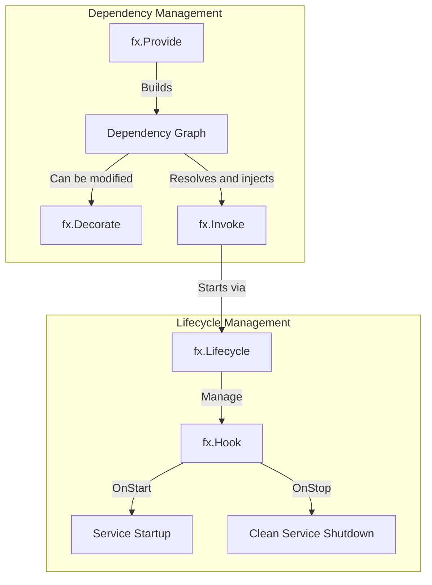

+++
title = "Mastering Dependency Injection in Go with Uber FX"
date = 2025-09-13T10:00:00+02:00
draft = false
tags = ['golang', 'uber-fx', 'dependency-injection', 'architecture']
categories = ['go', 'frameworks']
+++



Changing ecosystems is never easy. So imagine a company like M6 Web, with more than 15 years of PHP experience, being offered to abandon Symfony overnight and switch to Go.

Having worked with Symfony [^1] for many years myself, I must admit I became addicted to its dependency injection system: it's simple to get started with, perfectly documented, and thanks to autowiring, its usage becomes almost transparent. It's so convenient that we forget all the time saved daily.

That's why, when I started thinking about this language change with my team, we started from a clear observation: regardless of the direction we would take, we first needed to choose a dependency injection solution. Everything else would naturally graft onto it.

It was with this in mind that we decided to explore FX [^2], a dependency injection solution developed by Uber.

## Overview

FX is a library very rich in features, but to summarize, it has two main components:
- dependency management
- lifecycle management of these dependencies



- **fx.Provide**: injects a dependency into FX's dependency container
- **fx.Decorate**: modifies or enriches an existing dependency (that we will have previously declared in FX)
- **fx.Invoke**: uses a dependency to execute code. Each invoked component goes through FX's lifecycle manager.
- **fx.Lifecycle**: manages startup (OnStart) and shutdown (OnStop) of components that need to be started or stopped

## How FX Works

### Step 1: fx.Provide

Let's start with a simple Doer interface.

```go {linenos=inline hl_lines=[]}
package main

import (
	"fmt"

	"go.uber.org/fx"
)

type Doer interface {
	Do()
}

var _ Doer = (*DoerImpl)(nil)

type DoerImpl struct{}

func NewDoerImpl() Doer {
	return &DoerImpl{}
}

func (d DoerImpl) Do() {
	fmt.Println(">>>>> DoerImpl.Do()")
}

func main() {
	fx.New(
		fx.Provide(NewDoerImpl),
	).Run()
}
```

Here `NewDoerImpl` is registered and available in the dependency graph.

```
go run ./main.go
[Fx] PROVIDE	fx.Lifecycle <= go.uber.org/fx.New.func1()
[Fx] PROVIDE	fx.Shutdowner <= go.uber.org/fx.(*App).shutdowner-fm()
[Fx] PROVIDE	fx.DotGraph <= go.uber.org/fx.(*App).dotGraph-fm()
[Fx] PROVIDE	*main.DoerImpl <= main.NewDoerImpl()
[Fx] RUNNING
```

`>>>>> DoerImpl.Do()` is not displayed however because the structure is indeed instantiated but never invoked.

### Step 2: fx.Invoke

```go {linenos=inline hl_lines=["25-27", 32]}
package main

import (
	"fmt"

	"go.uber.org/fx"
)

type Doer interface {
	Do()
}

var _ Doer = (*DoerImpl)(nil)

type DoerImpl struct{}

func NewDoerImpl() Doer {
	return &DoerImpl{}
}

func (d DoerImpl) Do() {
	fmt.Println(">>>>> DoerImpl.Do()")
}

func DoerFunc(doer Doer) {
	doer.Do()
}

func main() {
	fx.New(
		fx.Provide(NewDoerImpl),
		fx.Invoke(DoerFunc),
	).Run()
}

```
Here `DoerFunc` consumes the DoerImpl dependency provided by `fx.Provide`.

```
go run ./main.go
[Fx] PROVIDE	fx.Lifecycle <= go.uber.org/fx.New.func1()
[Fx] PROVIDE	fx.Shutdowner <= go.uber.org/fx.(*App).shutdowner-fm()
[Fx] PROVIDE	fx.DotGraph <= go.uber.org/fx.(*App).dotGraph-fm()
[Fx] PROVIDE	main.Doer <= main.NewDoerImpl()
[Fx] INVOKE		main.DoerFunc()
[Fx] BEFORE RUN	provide: main.NewDoerImpl()
[Fx] RUN	provide: main.NewDoerImpl() in 58.708µs
>>>>> DoerImpl.Do()
[Fx] RUNNING
```

`>>>>> DoerImpl.Do()` is displayed this time.

### Step 3: fx.Decorate

We will now decorate our first Doer implementation.

```go {linenos=inline hl_lines=["25-38", 47]}
package main

import (
	"fmt"

	"go.uber.org/fx"
)

type Doer interface {
	Do()
}

var _ Doer = (*DoerImpl)(nil)

type DoerImpl struct{}

func NewDoerImpl() Doer {
	return &DoerImpl{}
}

func (d DoerImpl) Do() {
	fmt.Println(">>>>> DoerImpl.Do()")
}

var _ Doer = (*DecorationForDoerImpl)(nil)

type DecorationForDoerImpl struct {
	inner Doer
}

func NewDecorationForDoerImpl(inner Doer) Doer {
	return &DecorationForDoerImpl{inner: inner}
}

func (d DecorationForDoerImpl) Do() {
	fmt.Println(">>>>> DecorationForDoerImpl.Do()")
	d.inner.Do()
}

func DoerFunc(doer Doer) {
	doer.Do()
}

func main() {
	fx.New(
		fx.Provide(NewDoerImpl),
		fx.Decorate(NewDecorationForDoerImpl),
		fx.Invoke(DoerFunc),
	).Run()
}
```


`fx.Decorate` replaces the Config value with a modified version.

```
go run ./main.go
[Fx] PROVIDE	fx.Lifecycle <= go.uber.org/fx.New.func1()
[Fx] PROVIDE	fx.Shutdowner <= go.uber.org/fx.(*App).shutdowner-fm()
[Fx] PROVIDE	fx.DotGraph <= go.uber.org/fx.(*App).dotGraph-fm()
[Fx] PROVIDE	main.Doer <= main.NewDoerImpl()
[Fx] DECORATE	main.Doer <= main.NewDecorationForDoerImpl()
[Fx] INVOKE		main.DoerFunc()
[Fx] BEFORE RUN	provide: main.NewDoerImpl()
[Fx] RUN	provide: main.NewDoerImpl() in 168.167µs
[Fx] BEFORE RUN	decorate: main.NewDecorationForDoerImpl()
[Fx] RUN	decorate: main.NewDecorationForDoerImpl() in 3.292µs
>>>>> DecorationForDoerImpl.Do()
>>>>> DoerImpl.Do()
[Fx] RUNNING
```

### Step 4: fx.Lifecycle

Here we're going to test the `OnStart` and `OnStop` hooks and for that, we're going to slightly modify our program because `Run()` waits for a stop signal (SIGTERM or SIGINT).
That's why we're going to use the `Start(ctx context.Context)` method which won't wait for anything to stop the program once `fx.Invoke` is launched.

Our `DoerFunc()` function just learned to count to 3.

```go {linenos=inline hl_lines=["21-30","46-55"]}
package main

import (
	"context"
	"fmt"
	"time"

	"go.uber.org/fx"
)

type Doer interface {
	Do()
}

var _ Doer = (*DoerImpl)(nil)

type DoerImpl struct{}

func NewDoerImpl(lc fx.Lifecycle) Doer {
	doer := &DoerImpl{}
	lc.Append(fx.Hook{
		OnStart: func(ctx context.Context) error {
			fmt.Println(">>>>> DoerImpl.OnStart()")
			return nil
		},
		OnStop: func(ctx context.Context) error {
			fmt.Println(">>>>> DoerImpl.OnStop()")
			return nil
		},
	})
	return doer
}

func (d DoerImpl) Do() {
	fmt.Println(">>>>> DoerImpl.Do()")
}

var _ Doer = (*DecorationForDoerImpl)(nil)

type DecorationForDoerImpl struct {
	inner Doer
}

func NewDecorationForDoerImpl(inner Doer, lc fx.Lifecycle) Doer {
	doer := &DecorationForDoerImpl{inner: inner}
	lc.Append(fx.Hook{
		OnStart: func(ctx context.Context) error {
			fmt.Println(">>>>> DecorationForDoerImpl.OnStart()")
			return nil
		},
		OnStop: func(ctx context.Context) error {
			fmt.Println(">>>>> DecorationForDoerImpl.OnStop()")
			return nil
		},
	})
	return doer
}

func (d DecorationForDoerImpl) Do() {
	fmt.Println(">>>>> DecorationForDoerImpl.Do()")
	d.inner.Do()
}

func DoerFunc(doer Doer) {
	for i := 0; i < 3; i++ {
		doer.Do()
		fmt.Println(">>>>> Sleeping 1 second")
		time.Sleep(time.Second * 1)
	}
}

func main() {
	err := fx.New(
		fx.Provide(NewDoerImpl),
		fx.Decorate(NewDecorationForDoerImpl),
		fx.Invoke(DoerFunc),
	).Start(context.Background())
	if err != nil {
		return
	}
}
```

Here, we went all the way by adding the `OnStart` and `OnStop` hooks on all Doer implementations.

```
go run ./main.go
[Fx] PROVIDE	fx.Lifecycle <= go.uber.org/fx.New.func1()
[Fx] PROVIDE	fx.Shutdowner <= go.uber.org/fx.(*App).shutdowner-fm()
[Fx] PROVIDE	fx.DotGraph <= go.uber.org/fx.(*App).dotGraph-fm()
[Fx] PROVIDE	main.Doer <= main.NewDoerImpl()
[Fx] DECORATE	main.Doer <= main.NewDecorationForDoerImpl()
[Fx] INVOKE		main.DoerFunc()
[Fx] BEFORE RUN	provide: go.uber.org/fx.New.func1()
[Fx] RUN	provide: go.uber.org/fx.New.func1() in 41.042µs
[Fx] BEFORE RUN	provide: main.NewDoerImpl()
[Fx] RUN	provide: main.NewDoerImpl() in 96.834µs
[Fx] BEFORE RUN	decorate: main.NewDecorationForDoerImpl()
[Fx] RUN	decorate: main.NewDecorationForDoerImpl() in 15.625µs
>>>>> DecorationForDoerImpl.Do()
>>>>> DoerImpl.Do()
>>>>> Sleeping 1 second
>>>>> DecorationForDoerImpl.Do()
>>>>> DoerImpl.Do()
>>>>> Sleeping 1 second
>>>>> DecorationForDoerImpl.Do()
>>>>> DoerImpl.Do()
>>>>> Sleeping 1 second
[Fx] HOOK OnStart		main.NewDoerImpl.func1() executing (caller: main.NewDoerImpl)
>>>>> DoerImpl.OnStart()
[Fx] HOOK OnStart		main.NewDoerImpl.func1() called by main.NewDoerImpl ran successfully in 8.208µs
[Fx] HOOK OnStart		main.NewDecorationForDoerImpl.func1() executing (caller: main.NewDecorationForDoerImpl)
>>>>> DecorationForDoerImpl.OnStart()
[Fx] HOOK OnStart		main.NewDecorationForDoerImpl.func1() called by main.NewDecorationForDoerImpl ran successfully in 2.125µs
[Fx] RUNNING
```

## Going Further

### Tagged Services

There are two ways to tag services:
- `name` tags that will allow you to name services and inject them by name. **This is mandatory if for example you want to differentiate two services having the same interface**
- `group` tags that will allow you to inject a collection of services named identically into a collection

For each of these tag types, you have the possibility to:
- create the tagged service: we will use the `fx.ResultTags` function
- inject the tagged service: we will use the `fx.ParamTags` function

Let's take the following example:

```go {linenos=inline hl_lines=["40-54", "82-93"]}
package main

import (
	"context"
	"fmt"

	"go.uber.org/fx"
)

type Doer interface {
	Do()
}

var _ Doer = (*DoerImpl)(nil)

type DoerImpl struct{}

func NewDoerImpl(lc fx.Lifecycle) Doer {
	return &DoerImpl{}
}

func (d DoerImpl) Do() {
	fmt.Println(">>>>> DoerImpl.Do()")
}

var _ Doer = (*DecorationForDoerImpl)(nil)

type DecorationForDoerImpl struct {
}

func NewDecorationForDoerImpl() Doer {
	return &DecorationForDoerImpl{}
}

func (d DecorationForDoerImpl) Do() {
	fmt.Println(">>>>> DecorationForDoerImpl.Do()")
}


// Injection 1 / Here, we inject the two named services
// `name:"doer.first"` and `name:"doer.second"`
func DoerFunc(first Doer, second Doer) {
	fmt.Println(">>>>> CALL EACH SERVICE")
	first.Do()
	second.Do()
}

// Injection 2 / Here, we inject `group:"doer"`
func DoerAllFunc(all []Doer) {
	fmt.Println(">>>>> CALL SLICE OF SERVICES")
	for _, doer := range all {
		doer.Do()
	}
}

func main() {
	fx.New(
		fx.Provide(
			// service declaration
			fx.Annotate(
				NewDoerImpl,
				fx.ResultTags(`name:"doer.first"`),
			),
			// service declaration
			fx.Annotate(
				NewDoerImpl,
				fx.ResultTags(`group:"doer"`),
			),
		),
		fx.Provide(
			// service declaration
			fx.Annotate(
				NewDecorationForDoerImpl,
				fx.ResultTags(`name:"doer.second"`),
			),
			// service declaration
			fx.Annotate(
				NewDecorationForDoerImpl,
				fx.ResultTags(`group:"doer"`),
			),
		),
		fx.Invoke(
			// Injection 1
			fx.Annotate(
				DoerFunc,
				fx.ParamTags(`name:"doer.first"`, `name:"doer.second"`),
			),
			// Injection 2
			fx.Annotate(
				DoerAllFunc,
				fx.ParamTags(`group:"doer"`),
			),
		),
	).Run()
}
```

```
 go run ./cmd/test/
[Fx] PROVIDE	fx.Lifecycle <= go.uber.org/fx.New.func1()
[Fx] PROVIDE	fx.Shutdowner <= go.uber.org/fx.(*App).shutdowner-fm()
[Fx] PROVIDE	fx.DotGraph <= go.uber.org/fx.(*App).dotGraph-fm()
[Fx] PROVIDE	main.Doer[name = "doer.first"] <= fx.Annotate(main.NewDoerImpl(), fx.ResultTags(["name:\"doer.first\""])
[Fx] PROVIDE	main.Doer[group = "doer"] <= fx.Annotate(main.NewDoerImpl(), fx.ResultTags(["group:\"doer\""])
[Fx] PROVIDE	main.Doer[name = "doer.second"] <= fx.Annotate(main.NewDecorationForDoerImpl(), fx.ResultTags(["name:\"doer.second\""])
[Fx] PROVIDE	main.Doer[group = "doer"] <= fx.Annotate(main.NewDecorationForDoerImpl(), fx.ResultTags(["group:\"doer\""])
[Fx] INVOKE		fx.Annotate(main.DoerFunc(), fx.ParamTags(["name:\"doer.first\"" "name:\"doer.second\""])
[Fx] BEFORE RUN	provide: go.uber.org/fx.New.func1()
[Fx] RUN	provide: go.uber.org/fx.New.func1() in 26.083µs
[Fx] BEFORE RUN	provide: fx.Annotate(main.NewDoerImpl(), fx.ResultTags(["name:\"doer.first\""])
[Fx] RUN	provide: fx.Annotate(main.NewDoerImpl(), fx.ResultTags(["name:\"doer.first\""]) in 100.917µs
[Fx] BEFORE RUN	provide: fx.Annotate(main.NewDecorationForDoerImpl(), fx.ResultTags(["name:\"doer.second\""])
[Fx] RUN	provide: fx.Annotate(main.NewDecorationForDoerImpl(), fx.ResultTags(["name:\"doer.second\""]) in 18.291µs
>>>>> CALL EACH SERVICE
>>>>> DoerImpl.Do()
>>>>> DecorationForDoerImpl.Do()
[Fx] INVOKE		fx.Annotate(main.DoerAllFunc(), fx.ParamTags(["group:\"doer\""])
[Fx] BEFORE RUN	provide: fx.Annotate(main.NewDoerImpl(), fx.ResultTags(["group:\"doer\""])
[Fx] RUN	provide: fx.Annotate(main.NewDoerImpl(), fx.ResultTags(["group:\"doer\""]) in 14.792µs
[Fx] BEFORE RUN	provide: fx.Annotate(main.NewDecorationForDoerImpl(), fx.ResultTags(["group:\"doer\""])
[Fx] RUN	provide: fx.Annotate(main.NewDecorationForDoerImpl(), fx.ResultTags(["group:\"doer\""]) in 15.542µs
>>>>> CALL SLICE OF SERVICES
>>>>> DoerImpl.Do()
>>>>> DecorationForDoerImpl.Do()
[Fx] HOOK OnStart		main.NewDoerImpl.func1() executing (caller: main.NewDoerImpl)
>>>>> DoerImpl.OnStart()
[Fx] HOOK OnStart		main.NewDoerImpl.func1() called by main.NewDoerImpl ran successfully in 1.166µs
[Fx] HOOK OnStart		main.NewDecorationForDoerImpl.func1() executing (caller: main.NewDecorationForDoerImpl)
>>>>> DecorationForDoerImpl.OnStart()
[Fx] HOOK OnStart		main.NewDecorationForDoerImpl.func1() called by main.NewDecorationForDoerImpl ran successfully in 1.292µs
[Fx] HOOK OnStart		main.NewDoerImpl.func1() executing (caller: main.NewDoerImpl)
>>>>> DoerImpl.OnStart()
[Fx] HOOK OnStart		main.NewDoerImpl.func1() called by main.NewDoerImpl ran successfully in 959ns
[Fx] HOOK OnStart		main.NewDecorationForDoerImpl.func1() executing (caller: main.NewDecorationForDoerImpl)
>>>>> DecorationForDoerImpl.OnStart()
[Fx] HOOK OnStart		main.NewDecorationForDoerImpl.func1() called by main.NewDecorationForDoerImpl ran successfully in 916ns
[Fx] RUNNING
```


### fx.In and fx.Out

It is also possible to not explicitly declare all this information by using:
- instead of `fx.ResultTags` use `fx.Out`
- instead of `fx.ParamTags` use `fx.In`

```go {linenos=inline hl_lines=["21-22","45-46", "64-65", 77]}
package main

import (
	"context"
	"fmt"

	"go.uber.org/fx"
)

type Doer interface {
	Do()
}

var _ Doer = (*DoerImpl)(nil)

type DoerImpl struct{}

type DoerFirstResults struct {
	fx.Out

	First Doer `name:"doer.first"`
	Group Doer `group:"doer"`
}

func NewDoerImpl() DoerFirstResults {
	doer := &DoerImpl{}
	return DoerFirstResults{
		First: doer,
		Group: doer,
	}
}

func (d DoerImpl) Do() {
	fmt.Println(">>>>> DoerImpl.Do()")
}

var _ Doer = (*DecorationForDoerImpl)(nil)

type DecorationForDoerImpl struct {
}

type DoerSecondResults struct {
	fx.Out

	Second Doer `name:"doer.second"`
	Group  Doer `group:"doer"`
}

func NewDecorationForDoerImpl() DoerSecondResults {
	doer := &DecorationForDoerImpl{}
	return DoerSecondResults{
		Second: doer,
		Group:  doer,
	}
}

func (d DecorationForDoerImpl) Do() {
	fmt.Println(">>>>> DecorationForDoerImpl.Do()")
}

type DoerParams struct {
	fx.In

	First  Doer `name:"doer.first"`
	Second Doer `name:"doer.second"`
}

func DoerFunc(params DoerParams) {
	fmt.Println(">>>>> CALL EACH SERVICE")
	params.First.Do()
	params.Second.Do()
}

type DoersParams struct {
	fx.In

	Doers []Doer `group:"doer"`
}

func DoerAllFunc(params DoersParams) {
	fmt.Println(">>>>> CALL SLICE OF SERVICES")
	for _, doer := range params.Doers {
		doer.Do()
	}
}

func main() {
	fx.New(
		fx.Provide(
			NewDoerImpl,
			NewDecorationForDoerImpl,
		),
		fx.Invoke(
			DoerFunc,
			DoerAllFunc,
		),
	).Run()
}
```

There is no difference between the two examples.

```
go run ./cmd/test/
[Fx] PROVIDE	fx.Lifecycle <= go.uber.org/fx.New.func1()
[Fx] PROVIDE	fx.Shutdowner <= go.uber.org/fx.(*App).shutdowner-fm()
[Fx] PROVIDE	fx.DotGraph <= go.uber.org/fx.(*App).dotGraph-fm()
[Fx] PROVIDE	main.Doer[name = "doer.first"] <= main.NewDoerImpl()
[Fx] PROVIDE	main.Doer[group = "doer"] <= main.NewDoerImpl()
[Fx] PROVIDE	main.Doer[name = "doer.second"] <= main.NewDecorationForDoerImpl()
[Fx] PROVIDE	main.Doer[group = "doer"] <= main.NewDecorationForDoerImpl()
[Fx] INVOKE		main.DoerFunc()
[Fx] BEFORE RUN	provide: go.uber.org/fx.New.func1()
[Fx] RUN	provide: go.uber.org/fx.New.func1() in 37.417µs
[Fx] BEFORE RUN	provide: main.NewDoerImpl()
[Fx] RUN	provide: main.NewDoerImpl() in 121.75µs
[Fx] BEFORE RUN	provide: main.NewDecorationForDoerImpl()
[Fx] RUN	provide: main.NewDecorationForDoerImpl() in 14.625µs
>>>>> CALL EACH SERVICE
>>>>> DoerImpl.Do()
>>>>> DecorationForDoerImpl.Do()
[Fx] INVOKE		main.DoerAllFunc()
>>>>> CALL SLICE OF SERVICES
>>>>> DoerImpl.Do()
>>>>> DecorationForDoerImpl.Do()
[Fx] HOOK OnStart		main.NewDoerImpl.func1() executing (caller: main.NewDoerImpl)
>>>>> DoerImpl.OnStart()
[Fx] HOOK OnStart		main.NewDoerImpl.func1() called by main.NewDoerImpl ran successfully in 1.083µs
[Fx] HOOK OnStart		main.NewDecorationForDoerImpl.func1() executing (caller: main.NewDecorationForDoerImpl)
>>>>> DecorationForDoerImpl.OnStart()
[Fx] HOOK OnStart		main.NewDecorationForDoerImpl.func1() called by main.NewDecorationForDoerImpl ran successfully in 959ns
[Fx] RUNNING
```

You therefore get the same results as previously. Nevertheless, it is strongly recommended to use this method with FX in order to reduce coupling between components.

### The Power of fx.Decorate in an Enterprise Context

When writing this section, I'm thinking very much of a friend who will recognize himself because I have the unfortunate tendency to love "decorating" all my code and to use this pattern constantly. Nevertheless, I think it's probably the developer's most powerful weapon when using a DI.

Let's take a simple example with this interface:

```go
type Repository interface {
    GetContent(id string) (string, error)
}
```

From the same interface, we can for example over several sprints:
- implement the database access repository
- implement cache management
- implement the creation of a "business" metric

#### Sprint 1 - Database Access

```go
type Repository interface {
    GetContent(id string) (string, error)
}
```

```go
type DBRepository struct{}

func (r *DBRepository) GetContent(id string) (string, error) {
    log.Println("Fetching from database")
    return "data-from-db", nil
}

func NewDBRepository() Repository {
    return &DBRepository{}
}
```

#### Sprint 2 - Let's Add Cache

```go
type CacheRepository struct {
    next  Repository
    cache map[string]string
}

func NewCacheRepository(next Repository) Repository {
    return &CacheRepository{next: next, cache: make(map[string]string)}
}

func (r *CacheRepository) GetContent(id string) (string, error) {
    if val, ok := r.cache[id]; ok {
        log.Println("Fetching from cache")
        return val, nil
    }
    log.Println("Cache miss -> fallback DB")
    val, err := r.next.GetContent(id)
    if err == nil {
        r.cache[id] = val
    }
    return val, err
}
```

**Assembly**

```go
app := fx.New(
    fx.Provide(NewDBRepository),
    fx.Decorate(NewCacheRepository),
    fx.Invoke(func(repo Repository) {
        repo.GetContent("123")
        repo.GetContent("123")
    }),
)
app.Run()
```

#### Sprint 3 - Let's Add Business Metrics

Rather than limiting ourselves to technical metrics, let's follow business indicators.

**Example: tracking content consulted by type**

```go
type Content struct {
    ID   string
    Type string // "article", "video", "image"
    Data string
}

type Repository interface {
    GetContent(id string) (Content, error)
}

type MetricsRepository struct {
    next   Repository
    byType *prometheus.CounterVec
}

func NewMetricsRepository(next Repository) Repository {
    counter := promauto.NewCounterVec(
        prometheus.CounterOpts{
            Name: "repository_content_requests_total",
            Help: "Number of content requests by type (business metric)",
        },
        []string{"type"},
    )
    return &MetricsRepository{next: next, byType: counter}
}

func (r *MetricsRepository) GetContent(id string) (Content, error) {
    content, err := r.next.GetContent(id)
    if err == nil {
        r.byType.WithLabelValues(content.Type).Inc()
        log.Printf("[METRICS] Content of type %s requested", content.Type)
    }
    return content, err
}
```

**Assembly**

```go
app := fx.New(
    fx.Provide(NewDBRepository),
    fx.Decorate(NewCacheRepository),
    fx.Decorate(NewMetricsRepository),
    fx.Invoke(func(repo Repository) {
        repo.GetContent("article-123")
        repo.GetContent("video-456")
    }),
)
app.Run()
```

### Testing our DI

FX comes with the `fxtest` package which allows you to test the DI. Some methods will be particularly useful:
- `fx.Populate` which will allow you to retrieve a structure to test it specifically in a DI usage context
- `fx.Replace` which will allow you to replace a service with a mock
- `app.RequireStart()` will trigger all the `OnStart` in order to be able to test the behaviors
- `app.RequireStop()` will do the same with the `OnStop`

```go
package main

import (
	"testing"

	"go.uber.org/fx"
	"go.uber.org/fx/fxtest"
)

func TestFXDoer(t *testing.T) {
	var first Doer
	var second Doer
	app := fxtest.New(
		t,
		fx.Provide(
			NewDoerImpl,
			NewDecorationForDoerImpl,
		),
		fx.Populate(
			fx.Annotate(
				&first,
				fx.ParamTags(`name:"doer.first"`),
			),
			fx.Annotate(
				&second,
				fx.ParamTags(`name:"doer.second"`),
			),
		),
	)
	defer app.RequireStart().RequireStop()
	first.Do()
	second.Do()
}

```

## Bonus

### Enable / Disable / Adapt FX Logging

You can choose to disable FX logs by adding `fx.NopLogger`

```go {linenos=inline hl_lines=[10]}
fx.New(
    fx.Provide(
        NewDoerImpl,
        NewDecorationForDoerImpl,
    ),
    fx.Invoke(
        DoerFunc,
        DoerAllFunc,
    ),
    fx.NopLogger,
).Run()
```
```
go run ./cmd/test
>>>>> CALL EACH SERVICE
>>>>> DoerImpl.Do()
>>>>> DecorationForDoerImpl.Do()
>>>>> CALL SLICE OF SERVICES
>>>>> DoerImpl.Do()
>>>>> DecorationForDoerImpl.Do()
>>>>> DoerImpl.OnStart()
>>>>> DecorationForDoerImpl.OnStart()
```


### Visualize your Dependencies with fx.DotGraph

FX provides a `fx.DotGraph` structure that will allow you to debug your dependency graph.

```go
// DotGraphHandler is a router decorator that adds a /graph endpoint to display the dependency graph
type DotGraphHandler struct {
    dot fx.DotGraph
}

// NewDotGraphHandler creates a new dot graph handler instance
func NewDotGraphHandler(dot fx.DotGraph) *DotGraphHandler {
    return &DotGraphHandler{dot: dot}
}

// Apply applies the router decorator to the router
func (d *DotGraphHandler) Apply(r chi.Router) error {
    r.Get("/graph", func (w http.ResponseWriter, _ *http.Request) {
    w.Header().Set("Content-Type", "text/vnd.graphviz")
        _, _ = w.Write([]byte(d.dot))
    })
    return nil
}

```

[^1]: [Symfony Dependency Injection Components](https://symfony.com/doc/current/components/dependency_injection.html)
[^2]: [Uber FX](https://uber-go.github.io/)