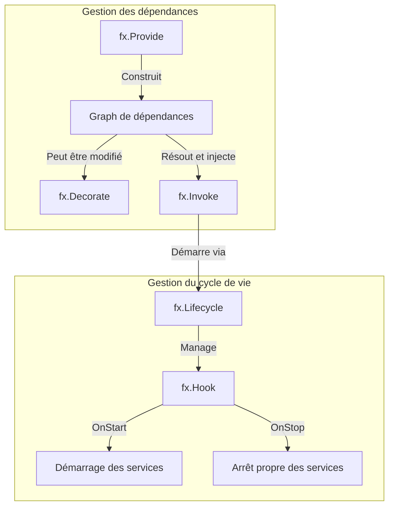

+++
title = "Maîtriser l'injection de dépendances en Go avec Uber FX"
date = 2025-09-13T10:00:00+02:00
draft = false
tags = ['golang', 'uber-fx', 'dependency-injection', 'architecture']
categories = ['go', 'frameworks']
+++



Changer d’écosystème n’est jamais évident. Alors imaginez une entreprise comme M6 Web, avec plus de 15 ans d’expérience en PHP, à qui l’on propose du jour au lendemain d’abandonner Symfony pour passer à Go.

Ayant moi-même travaillé de longues années avec Symfony [^1], je dois avouer que je suis devenu accro à son système d’injection de dépendances : il est simple à prendre en main, parfaitement documenté, et grâce à l’autowiring, son utilisation devient presque transparente. C’est tellement pratique qu’on en oublie tout le temps gagné au quotidien.

C’est pourquoi, lorsque j’ai commencé à réfléchir à ce changement de langage avec mon équipe, nous sommes partis d’un constat clair : peu importe la direction que nous prendrions, il nous fallait d’abord choisir une solution d’injection de dépendances. Tout le reste viendrait naturellement se greffer dessus.

C’est dans cette optique que nous avons décidé d’explorer FX [^2], une solution d'injection de dépendances développée par Uber.

## Présentation

FX est une librairie très riche en fonctionnalités mais pour résumer, elle possède deux principaux composants :
- la gestion des dépendances
- la gestion du cycle de vie de ces dépendances



- **fx.Provide** : injecte une dépendance dans le conteneur de dépendances de FX
- **fx.Decorate** : modifie ou enrichit une dépendance existante (qu'on aura préalablement déclarée dans FX)
- **fx.Invoke** : utilise une dépendance pour exécuter du code. Chaque composant invoqué passe dans le gestionnaire de cycle de vie de FX.
- **fx.Lifecycle** : gère le démarrage (OnStart) et l'arrêt (OnStop) des composants qui ont besoin d'être démarrés ou arrêtés

## Le fonctionnement de FX

### Étape 1 : fx.Provide

Partons d'une simple interface Doer.

```go {linenos=inline hl_lines=[]}
package main

import (
	"fmt"

	"go.uber.org/fx"
)

type Doer interface {
	Do()
}

var _ Doer = (*DoerImpl)(nil)

type DoerImpl struct{}

func NewDoerImpl() Doer {
	return &DoerImpl{}
}

func (d DoerImpl) Do() {
	fmt.Println(">>>>> DoerImpl.Do()")
}

func main() {
	fx.New(
		fx.Provide(NewDoerImpl),
	).Run()
}
```

Ici `NewDoerImpl` est enregistrée et disponible dans le graphe de dépendances.

```
go run ./main.go
[Fx] PROVIDE	fx.Lifecycle <= go.uber.org/fx.New.func1()
[Fx] PROVIDE	fx.Shutdowner <= go.uber.org/fx.(*App).shutdowner-fm()
[Fx] PROVIDE	fx.DotGraph <= go.uber.org/fx.(*App).dotGraph-fm()
[Fx] PROVIDE	*main.DoerImpl <= main.NewDoerImpl()
[Fx] RUNNING
```

`>>>>> DoerImpl.Do()` n'est toutefois pas affiché car la structure est bien instanciée mais n'est jamais invoquée.

### Étape 2 : fx.Invoke

```go {linenos=inline hl_lines=["25-27", 32]}
package main

import (
	"fmt"

	"go.uber.org/fx"
)

type Doer interface {
	Do()
}

var _ Doer = (*DoerImpl)(nil)

type DoerImpl struct{}

func NewDoerImpl() Doer {
	return &DoerImpl{}
}

func (d DoerImpl) Do() {
	fmt.Println(">>>>> DoerImpl.Do()")
}

func DoerFunc(doer Doer) {
	doer.Do()
}

func main() {
	fx.New(
		fx.Provide(NewDoerImpl),
		fx.Invoke(DoerFunc),
	).Run()
}

```
Ici `DoerFunc` consomme la dépendance DoerImpl fournie par `fx.Provide`.

```
go run ./main.go
[Fx] PROVIDE	fx.Lifecycle <= go.uber.org/fx.New.func1()
[Fx] PROVIDE	fx.Shutdowner <= go.uber.org/fx.(*App).shutdowner-fm()
[Fx] PROVIDE	fx.DotGraph <= go.uber.org/fx.(*App).dotGraph-fm()
[Fx] PROVIDE	main.Doer <= main.NewDoerImpl()
[Fx] INVOKE		main.DoerFunc()
[Fx] BEFORE RUN	provide: main.NewDoerImpl()
[Fx] RUN	provide: main.NewDoerImpl() in 58.708µs
>>>>> DoerImpl.Do()
[Fx] RUNNING
```

`>>>>> DoerImpl.Do()` s'affiche donc cette fois-ci.

### Étape 3 : fx.Decorate

Nous allons maintenant décorer notre première implémentation de Doer.

```go {linenos=inline hl_lines=["25-38", 47]}
package main

import (
	"fmt"

	"go.uber.org/fx"
)

type Doer interface {
	Do()
}

var _ Doer = (*DoerImpl)(nil)

type DoerImpl struct{}

func NewDoerImpl() Doer {
	return &DoerImpl{}
}

func (d DoerImpl) Do() {
	fmt.Println(">>>>> DoerImpl.Do()")
}

var _ Doer = (*DecorationForDoerImpl)(nil)

type DecorationForDoerImpl struct {
	inner Doer
}

func NewDecorationForDoerImpl(inner Doer) Doer {
	return &DecorationForDoerImpl{inner: inner}
}

func (d DecorationForDoerImpl) Do() {
	fmt.Println(">>>>> DecorationForDoerImpl.Do()")
	d.inner.Do()
}

func DoerFunc(doer Doer) {
	doer.Do()
}

func main() {
	fx.New(
		fx.Provide(NewDoerImpl),
		fx.Decorate(NewDecorationForDoerImpl),
		fx.Invoke(DoerFunc),
	).Run()
}
```


`fx.Decorate` remplace la valeur de Config par une version modifiée.

```
go run ./main.go
[Fx] PROVIDE	fx.Lifecycle <= go.uber.org/fx.New.func1()
[Fx] PROVIDE	fx.Shutdowner <= go.uber.org/fx.(*App).shutdowner-fm()
[Fx] PROVIDE	fx.DotGraph <= go.uber.org/fx.(*App).dotGraph-fm()
[Fx] PROVIDE	main.Doer <= main.NewDoerImpl()
[Fx] DECORATE	main.Doer <= main.NewDecorationForDoerImpl()
[Fx] INVOKE		main.DoerFunc()
[Fx] BEFORE RUN	provide: main.NewDoerImpl()
[Fx] RUN	provide: main.NewDoerImpl() in 168.167µs
[Fx] BEFORE RUN	decorate: main.NewDecorationForDoerImpl()
[Fx] RUN	decorate: main.NewDecorationForDoerImpl() in 3.292µs
>>>>> DecorationForDoerImpl.Do()
>>>>> DoerImpl.Do()
[Fx] RUNNING
```

### Étape 4 : fx.Lifecycle

Ici nous allons tester les hooks `OnStart` et `OnStop` et pour celà, nous allons légèrement modifier notre programme car `Run()` attends un signal d'arrêt (SIGTERM ou SIGINT). 
C'est pourquoi nous allons utiliser la méthode `Start(ctx context.Context)` qui ne va pas attendre quoique ce soit pour arrêter le programme une fois `fx.Invoke` lancé.

Notre fonction `DoerFunc()` vient d'apprendre à compter jusqu'à 3.

```go {linenos=inline hl_lines=["21-30","46-55"]}
package main

import (
	"context"
	"fmt"
	"time"

	"go.uber.org/fx"
)

type Doer interface {
	Do()
}

var _ Doer = (*DoerImpl)(nil)

type DoerImpl struct{}

func NewDoerImpl(lc fx.Lifecycle) Doer {
	doer := &DoerImpl{}
	lc.Append(fx.Hook{
		OnStart: func(ctx context.Context) error {
			fmt.Println(">>>>> DoerImpl.OnStart()")
			return nil
		},
		OnStop: func(ctx context.Context) error {
			fmt.Println(">>>>> DoerImpl.OnStop()")
			return nil
		},
	})
	return doer
}

func (d DoerImpl) Do() {
	fmt.Println(">>>>> DoerImpl.Do()")
}

var _ Doer = (*DecorationForDoerImpl)(nil)

type DecorationForDoerImpl struct {
	inner Doer
}

func NewDecorationForDoerImpl(inner Doer, lc fx.Lifecycle) Doer {
	doer := &DecorationForDoerImpl{inner: inner}
	lc.Append(fx.Hook{
		OnStart: func(ctx context.Context) error {
			fmt.Println(">>>>> DecorationForDoerImpl.OnStart()")
			return nil
		},
		OnStop: func(ctx context.Context) error {
			fmt.Println(">>>>> DecorationForDoerImpl.OnStop()")
			return nil
		},
	})
	return doer
}

func (d DecorationForDoerImpl) Do() {
	fmt.Println(">>>>> DecorationForDoerImpl.Do()")
	d.inner.Do()
}

func DoerFunc(doer Doer) {
	for i := 0; i < 3; i++ {
		doer.Do()
		fmt.Println(">>>>> Sleeping 1 second")
		time.Sleep(time.Second * 1)
	}
}

func main() {
	err := fx.New(
		fx.Provide(NewDoerImpl),
		fx.Decorate(NewDecorationForDoerImpl),
		fx.Invoke(DoerFunc),
	).Start(context.Background())
	if err != nil {
		return
	}
}
```

Ici, nous sommes allés au bout des choses en ajoutant les hooks `OnStart` et `OnStop` sur l'ensemble des implémentations de Doer.

```
go run ./main.go
[Fx] PROVIDE	fx.Lifecycle <= go.uber.org/fx.New.func1()
[Fx] PROVIDE	fx.Shutdowner <= go.uber.org/fx.(*App).shutdowner-fm()
[Fx] PROVIDE	fx.DotGraph <= go.uber.org/fx.(*App).dotGraph-fm()
[Fx] PROVIDE	main.Doer <= main.NewDoerImpl()
[Fx] DECORATE	main.Doer <= main.NewDecorationForDoerImpl()
[Fx] INVOKE		main.DoerFunc()
[Fx] BEFORE RUN	provide: go.uber.org/fx.New.func1()
[Fx] RUN	provide: go.uber.org/fx.New.func1() in 41.042µs
[Fx] BEFORE RUN	provide: main.NewDoerImpl()
[Fx] RUN	provide: main.NewDoerImpl() in 96.834µs
[Fx] BEFORE RUN	decorate: main.NewDecorationForDoerImpl()
[Fx] RUN	decorate: main.NewDecorationForDoerImpl() in 15.625µs
>>>>> DecorationForDoerImpl.Do()
>>>>> DoerImpl.Do()
>>>>> Sleeping 1 second
>>>>> DecorationForDoerImpl.Do()
>>>>> DoerImpl.Do()
>>>>> Sleeping 1 second
>>>>> DecorationForDoerImpl.Do()
>>>>> DoerImpl.Do()
>>>>> Sleeping 1 second
[Fx] HOOK OnStart		main.NewDoerImpl.func1() executing (caller: main.NewDoerImpl)
>>>>> DoerImpl.OnStart()
[Fx] HOOK OnStart		main.NewDoerImpl.func1() called by main.NewDoerImpl ran successfully in 8.208µs
[Fx] HOOK OnStart		main.NewDecorationForDoerImpl.func1() executing (caller: main.NewDecorationForDoerImpl)
>>>>> DecorationForDoerImpl.OnStart()
[Fx] HOOK OnStart		main.NewDecorationForDoerImpl.func1() called by main.NewDecorationForDoerImpl ran successfully in 2.125µs
[Fx] RUNNING
```

## Pour aller plus loin

### Les services taggés

Il existe deux façons de tagger des services :
- les tags `name` qui vont permettre de nommer des services et de les injecter depuis leur nom. **C'est obligatoire si par exemple vous souhaitez différencier deux services ayant la même interface**
- les tags de `group` qui vont permettre d'injecter une collection de services nommés de manière identique dans une collection 

Pour chacun de ces types de tag, vous avez la possibilité de :
- créer le service taggé : on utilisera la fonction `fx.ResultTags`
- injecter le service taggé : on utilisera la fonction `fx.ParamTags`

Prenons l'exemple suivant :

```go {linenos=inline hl_lines=["40-54", "82-93"]}
package main

import (
	"context"
	"fmt"

	"go.uber.org/fx"
)

type Doer interface {
	Do()
}

var _ Doer = (*DoerImpl)(nil)

type DoerImpl struct{}

func NewDoerImpl(lc fx.Lifecycle) Doer {
	return &DoerImpl{}
}

func (d DoerImpl) Do() {
	fmt.Println(">>>>> DoerImpl.Do()")
}

var _ Doer = (*DecorationForDoerImpl)(nil)

type DecorationForDoerImpl struct {
}

func NewDecorationForDoerImpl() Doer {
	return &DecorationForDoerImpl{}
}

func (d DecorationForDoerImpl) Do() {
	fmt.Println(">>>>> DecorationForDoerImpl.Do()")
}


// Injection 1 / Ici, on injecte les deux services nommés 
// `name:"doer.first"` et `name:"doer.second"`
func DoerFunc(first Doer, second Doer) {
	fmt.Println(">>>>> CALL EACH SERVICE")
	first.Do()
	second.Do()
}

// Injection 2 / Ici, on injecte `group:"doer"`
func DoerAllFunc(all []Doer) {
	fmt.Println(">>>>> CALL SLICE OF SERVICES")
	for _, doer := range all {
		doer.Do()
	}
}

func main() {
	fx.New(
		fx.Provide(
			// déclaration de service 
			fx.Annotate(
				NewDoerImpl,
				fx.ResultTags(`name:"doer.first"`),
			),
			// déclaration de service 
			fx.Annotate(
				NewDoerImpl,
				fx.ResultTags(`group:"doer"`),
			),
		),
		fx.Provide(
			// déclaration de service 
			fx.Annotate(
				NewDecorationForDoerImpl,
				fx.ResultTags(`name:"doer.second"`),
			),
			// déclaration de service 
			fx.Annotate(
				NewDecorationForDoerImpl,
				fx.ResultTags(`group:"doer"`),
			),
		),
		fx.Invoke(
			// Injection 1
			fx.Annotate(
				DoerFunc,
				fx.ParamTags(`name:"doer.first"`, `name:"doer.second"`),
			),
			// Injection 2
			fx.Annotate(
				DoerAllFunc,
				fx.ParamTags(`group:"doer"`),
			),
		),
	).Run()
}
```

```
 go run ./cmd/test/
[Fx] PROVIDE	fx.Lifecycle <= go.uber.org/fx.New.func1()
[Fx] PROVIDE	fx.Shutdowner <= go.uber.org/fx.(*App).shutdowner-fm()
[Fx] PROVIDE	fx.DotGraph <= go.uber.org/fx.(*App).dotGraph-fm()
[Fx] PROVIDE	main.Doer[name = "doer.first"] <= fx.Annotate(main.NewDoerImpl(), fx.ResultTags(["name:\"doer.first\""])
[Fx] PROVIDE	main.Doer[group = "doer"] <= fx.Annotate(main.NewDoerImpl(), fx.ResultTags(["group:\"doer\""])
[Fx] PROVIDE	main.Doer[name = "doer.second"] <= fx.Annotate(main.NewDecorationForDoerImpl(), fx.ResultTags(["name:\"doer.second\""])
[Fx] PROVIDE	main.Doer[group = "doer"] <= fx.Annotate(main.NewDecorationForDoerImpl(), fx.ResultTags(["group:\"doer\""])
[Fx] INVOKE		fx.Annotate(main.DoerFunc(), fx.ParamTags(["name:\"doer.first\"" "name:\"doer.second\""])
[Fx] BEFORE RUN	provide: go.uber.org/fx.New.func1()
[Fx] RUN	provide: go.uber.org/fx.New.func1() in 26.083µs
[Fx] BEFORE RUN	provide: fx.Annotate(main.NewDoerImpl(), fx.ResultTags(["name:\"doer.first\""])
[Fx] RUN	provide: fx.Annotate(main.NewDoerImpl(), fx.ResultTags(["name:\"doer.first\""]) in 100.917µs
[Fx] BEFORE RUN	provide: fx.Annotate(main.NewDecorationForDoerImpl(), fx.ResultTags(["name:\"doer.second\""])
[Fx] RUN	provide: fx.Annotate(main.NewDecorationForDoerImpl(), fx.ResultTags(["name:\"doer.second\""]) in 18.291µs
>>>>> CALL EACH SERVICE
>>>>> DoerImpl.Do()
>>>>> DecorationForDoerImpl.Do()
[Fx] INVOKE		fx.Annotate(main.DoerAllFunc(), fx.ParamTags(["group:\"doer\""])
[Fx] BEFORE RUN	provide: fx.Annotate(main.NewDoerImpl(), fx.ResultTags(["group:\"doer\""])
[Fx] RUN	provide: fx.Annotate(main.NewDoerImpl(), fx.ResultTags(["group:\"doer\""]) in 14.792µs
[Fx] BEFORE RUN	provide: fx.Annotate(main.NewDecorationForDoerImpl(), fx.ResultTags(["group:\"doer\""])
[Fx] RUN	provide: fx.Annotate(main.NewDecorationForDoerImpl(), fx.ResultTags(["group:\"doer\""]) in 15.542µs
>>>>> CALL SLICE OF SERVICES
>>>>> DoerImpl.Do()
>>>>> DecorationForDoerImpl.Do()
[Fx] HOOK OnStart		main.NewDoerImpl.func1() executing (caller: main.NewDoerImpl)
>>>>> DoerImpl.OnStart()
[Fx] HOOK OnStart		main.NewDoerImpl.func1() called by main.NewDoerImpl ran successfully in 1.166µs
[Fx] HOOK OnStart		main.NewDecorationForDoerImpl.func1() executing (caller: main.NewDecorationForDoerImpl)
>>>>> DecorationForDoerImpl.OnStart()
[Fx] HOOK OnStart		main.NewDecorationForDoerImpl.func1() called by main.NewDecorationForDoerImpl ran successfully in 1.292µs
[Fx] HOOK OnStart		main.NewDoerImpl.func1() executing (caller: main.NewDoerImpl)
>>>>> DoerImpl.OnStart()
[Fx] HOOK OnStart		main.NewDoerImpl.func1() called by main.NewDoerImpl ran successfully in 959ns
[Fx] HOOK OnStart		main.NewDecorationForDoerImpl.func1() executing (caller: main.NewDecorationForDoerImpl)
>>>>> DecorationForDoerImpl.OnStart()
[Fx] HOOK OnStart		main.NewDecorationForDoerImpl.func1() called by main.NewDecorationForDoerImpl ran successfully in 916ns
[Fx] RUNNING
```

    
### fx.In et fx.Out

Il est également possible de ne pas déclarer explicitement toute ces informations en utilisant : 
- à la place de `fx.ResultTags` utiliser `fx.Out`
- à la place de `fx.ParamTags` utiliser `fx.In`

```go {linenos=inline hl_lines=["21-22","45-46", "64-65", 77]}
package main

import (
	"context"
	"fmt"

	"go.uber.org/fx"
)

type Doer interface {
	Do()
}

var _ Doer = (*DoerImpl)(nil)

type DoerImpl struct{}

type DoerFirstResults struct {
	fx.Out

	First Doer `name:"doer.first"`
	Group Doer `group:"doer"`
}

func NewDoerImpl() DoerFirstResults {
	doer := &DoerImpl{}
	return DoerFirstResults{
		First: doer,
		Group: doer,
	}
}

func (d DoerImpl) Do() {
	fmt.Println(">>>>> DoerImpl.Do()")
}

var _ Doer = (*DecorationForDoerImpl)(nil)

type DecorationForDoerImpl struct {
}

type DoerSecondResults struct {
	fx.Out

	Second Doer `name:"doer.second"`
	Group  Doer `group:"doer"`
}

func NewDecorationForDoerImpl() DoerSecondResults {
	doer := &DecorationForDoerImpl{}
	return DoerSecondResults{
		Second: doer,
		Group:  doer,
	}
}

func (d DecorationForDoerImpl) Do() {
	fmt.Println(">>>>> DecorationForDoerImpl.Do()")
}

type DoerParams struct {
	fx.In

	First  Doer `name:"doer.first"`
	Second Doer `name:"doer.second"`
}

func DoerFunc(params DoerParams) {
	fmt.Println(">>>>> CALL EACH SERVICE")
	params.First.Do()
	params.Second.Do()
}

type DoersParams struct {
	fx.In

	Doers []Doer `group:"doer"`
}

func DoerAllFunc(params DoersParams) {
	fmt.Println(">>>>> CALL SLICE OF SERVICES")
	for _, doer := range params.Doers {
		doer.Do()
	}
}

func main() {
	fx.New(
		fx.Provide(
			NewDoerImpl,
			NewDecorationForDoerImpl,
		),
		fx.Invoke(
			DoerFunc,
			DoerAllFunc,
		),
	).Run()
}
```

Il n'y a aucune différence entre les deux exemples.

```
go run ./cmd/test/
[Fx] PROVIDE	fx.Lifecycle <= go.uber.org/fx.New.func1()
[Fx] PROVIDE	fx.Shutdowner <= go.uber.org/fx.(*App).shutdowner-fm()
[Fx] PROVIDE	fx.DotGraph <= go.uber.org/fx.(*App).dotGraph-fm()
[Fx] PROVIDE	main.Doer[name = "doer.first"] <= main.NewDoerImpl()
[Fx] PROVIDE	main.Doer[group = "doer"] <= main.NewDoerImpl()
[Fx] PROVIDE	main.Doer[name = "doer.second"] <= main.NewDecorationForDoerImpl()
[Fx] PROVIDE	main.Doer[group = "doer"] <= main.NewDecorationForDoerImpl()
[Fx] INVOKE		main.DoerFunc()
[Fx] BEFORE RUN	provide: go.uber.org/fx.New.func1()
[Fx] RUN	provide: go.uber.org/fx.New.func1() in 37.417µs
[Fx] BEFORE RUN	provide: main.NewDoerImpl()
[Fx] RUN	provide: main.NewDoerImpl() in 121.75µs
[Fx] BEFORE RUN	provide: main.NewDecorationForDoerImpl()
[Fx] RUN	provide: main.NewDecorationForDoerImpl() in 14.625µs
>>>>> CALL EACH SERVICE
>>>>> DoerImpl.Do()
>>>>> DecorationForDoerImpl.Do()
[Fx] INVOKE		main.DoerAllFunc()
>>>>> CALL SLICE OF SERVICES
>>>>> DoerImpl.Do()
>>>>> DecorationForDoerImpl.Do()
[Fx] HOOK OnStart		main.NewDoerImpl.func1() executing (caller: main.NewDoerImpl)
>>>>> DoerImpl.OnStart()
[Fx] HOOK OnStart		main.NewDoerImpl.func1() called by main.NewDoerImpl ran successfully in 1.083µs
[Fx] HOOK OnStart		main.NewDecorationForDoerImpl.func1() executing (caller: main.NewDecorationForDoerImpl)
>>>>> DecorationForDoerImpl.OnStart()
[Fx] HOOK OnStart		main.NewDecorationForDoerImpl.func1() called by main.NewDecorationForDoerImpl ran successfully in 959ns
[Fx] RUNNING
```

Vous obtenez donc les mêmes résultats que précédemment. Néanmoins, il est vivement recommandé d'utiliser cette méthode avec FX afin de réduire le couplage entre les composants.

### La puissance de fx.Decorate dans un contexte entreprise

En écrivant cette partie, je pense très fort à un ami qui se reconnaîtra car j'ai la fâcheuse tendance à adorer "décorer" tout mon code et à utiliser ce pattern constamment. Néanmoins, je pense que c'est probablement l'arme la plus puissante du développeur utilisant une DI.

Prenons un exemple simple avec cette interface : 

```go
type Repository interface {
    GetContent(id string) (string, error)
}
```

À partir d'une même interface, on va pouvoir par exemple sur plusieurs sprints : 
- implémenter le repository d'accès à la base de données
- implémenter la gestion du cache
- implémenter la création d'une métrique "métier"

#### Sprint 1 - L'accès à la base de données

```go
type Repository interface {
    GetContent(id string) (string, error)
}
```

```go
type DBRepository struct{}

func (r *DBRepository) GetContent(id string) (string, error) {
    log.Println("Fetching from database")
    return "data-from-db", nil
}

func NewDBRepository() Repository {
    return &DBRepository{}
}
```

#### Sprint 2 - Ajoutons du Cache

```go
type CacheRepository struct {
    next  Repository
    cache map[string]string
}

func NewCacheRepository(next Repository) Repository {
    return &CacheRepository{next: next, cache: make(map[string]string)}
}

func (r *CacheRepository) GetContent(id string) (string, error) {
    if val, ok := r.cache[id]; ok {
        log.Println("Fetching from cache")
        return val, nil
    }
    log.Println("Cache miss -> fallback DB")
    val, err := r.next.GetContent(id)
    if err == nil {
        r.cache[id] = val
    }
    return val, err
}
```

**Assemblage**

```go
app := fx.New(
    fx.Provide(NewDBRepository),
    fx.Decorate(NewCacheRepository),
    fx.Invoke(func(repo Repository) {
        repo.GetContent("123")
        repo.GetContent("123")
    }),
)
app.Run()
```

#### Sprint 3 - Ajoutons des métriques "métier"

Plutôt que de se limiter à des métriques techniques, suivons des indicateurs métiers.

**Exemple : suivi des contenus consultés par type**

```go
type Content struct {
    ID   string
    Type string // "article", "video", "image"
    Data string
}

type Repository interface {
    GetContent(id string) (Content, error)
}

type MetricsRepository struct {
    next   Repository
    byType *prometheus.CounterVec
}

func NewMetricsRepository(next Repository) Repository {
    counter := promauto.NewCounterVec(
        prometheus.CounterOpts{
            Name: "repository_content_requests_total",
            Help: "Number of content requests by type (business metric)",
        },
        []string{"type"},
    )
    return &MetricsRepository{next: next, byType: counter}
}

func (r *MetricsRepository) GetContent(id string) (Content, error) {
    content, err := r.next.GetContent(id)
    if err == nil {
        r.byType.WithLabelValues(content.Type).Inc()
        log.Printf("[METRICS] Content of type %s requested", content.Type)
    }
    return content, err
}
```

**Assemblage**

```go
app := fx.New(
    fx.Provide(NewDBRepository),
    fx.Decorate(NewCacheRepository),
    fx.Decorate(NewMetricsRepository),
    fx.Invoke(func(repo Repository) {
        repo.GetContent("article-123")
        repo.GetContent("video-456")
    }),
)
app.Run()
```

### Testons notre DI

FX arrive avec le package `txtest` qui permet de tester la DI. Quelques méthodes vont être particulièrement utile : 
- `fx.Populate` qui va permettre de récupérer une structure pour la tester spécifiquement dans un context d'utilisation de la DI
- `fx.Replace` qui va permettre de remplacer un service par un mock
- `app.RequireStart()` va déclancher l'ensemble des `OnStart` afin de pouvoir tester les comportements
- `app.RequireStop()` va faire de même avec les `OnStop`

```go
package main

import (
	"testing"

	"go.uber.org/fx"
	"go.uber.org/fx/fxtest"
)

func TestFXDoer(t *testing.T) {
	var first Doer
	var second Doer
	app := fxtest.New(
		t,
		fx.Provide(
			NewDoerImpl,
			NewDecorationForDoerImpl,
		),
		fx.Populate(
			fx.Annotate(
				&first,
				fx.ParamTags(`name:"doer.first"`),
			),
			fx.Annotate(
				&second,
				fx.ParamTags(`name:"doer.second"`),
			),
		),
	)
	defer app.RequireStart().RequireStop()
	first.Do()
	second.Do()
}

```

## Bonus

### Activer / Désactiver / Adapter le logging de FX

Vous pouvez choisir de désactiver les logs de FX en ajoutant `fx.NopLogger`

```go {linenos=inline hl_lines=[10]}
fx.New(
    fx.Provide(
        NewDoerImpl,
        NewDecorationForDoerImpl,
    ),
    fx.Invoke(
        DoerFunc,
        DoerAllFunc,
    ),
    fx.NopLogger,
).Run()
```
```
go run ./cmd/test
>>>>> CALL EACH SERVICE
>>>>> DoerImpl.Do()
>>>>> DecorationForDoerImpl.Do()
>>>>> CALL SLICE OF SERVICES
>>>>> DoerImpl.Do()
>>>>> DecorationForDoerImpl.Do()
>>>>> DoerImpl.OnStart()
>>>>> DecorationForDoerImpl.OnStart()
```


### Visualisez vos dépendances avec fx.DotGraph

FX fournis une structure `fx.DotGraph` qui va vous permettre de debug votre graph de dépendances.

```go
// DotGraphHandler is a router decorator that adds a /graph endpoint to display the dependency graph
type DotGraphHandler struct {
    dot fx.DotGraph
}

// NewDotGraphHandler creates a new dot graph handler instance
func NewDotGraphHandler(dot fx.DotGraph) *DotGraphHandler {
    return &DotGraphHandler{dot: dot}
}

// Apply applies the router decorator to the router
func (d *DotGraphHandler) Apply(r chi.Router) error {
    r.Get("/graph", func (w http.ResponseWriter, _ *http.Request) {
    w.Header().Set("Content-Type", "text/vnd.graphviz")
        _, _ = w.Write([]byte(d.dot))
    })
    return nil
}

```

[^1]: [Symfony Dependency Injection Components](https://symfony.com/doc/current/components/dependency_injection.html)
[^2]: [Uber FX](https://uber-go.github.io/)
